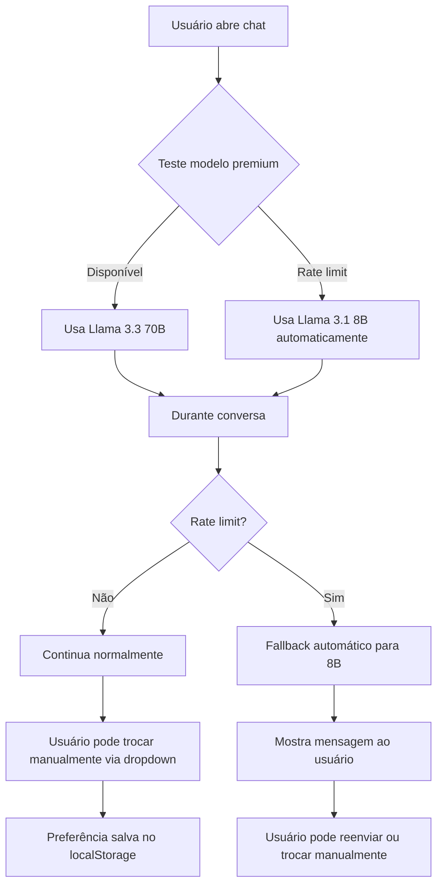

# Rate Limits e Otimização de API

## Problema Identificado

O sistema estava funcionando perfeitamente (criou e removeu seções com sucesso), mas depois parou de responder com erro **"Failed to get response"**.

### Causa Raiz

**Rate Limits da API Groq (2 tipos):**

#### 1. Limite por Dia (TPD - Tokens Per Day)
- **Limite:** 100.000 tokens por dia (plano gratuito)
- **Aplica-se a:** Todos os modelos compartilham esse limite
- **Tempo de reset:** 24 horas após início do dia
- **Erro:** HTTP 429 - `rate_limit_exceeded` (tokens per day)
- **Solução:** Aguarde próximo dia ou troque de modelo (economiza tokens)

#### 2. Limite por Minuto (TPM - Tokens Per Minute)
- **Llama 3.3 70B:** ~14.000 tokens por minuto
- **Llama 3.1 8B:** ~6.000 tokens por minuto
- **Tempo de reset:** ~5-30 segundos
- **Erro:** HTTP 429 - `rate_limit_exceeded` (tokens per minute)
- **Solução:** Aguarde alguns segundos antes de enviar próxima mensagem

**⚠️ Importante:** Ambos os limites são independentes! Você pode atingir limite por minuto mesmo tendo tokens disponíveis no dia.

## Soluções Implementadas

### 1. Detecção e Mensagem Amigável

```typescript
// components/AIChat.tsx
if (response.status === 429 && errorText.includes('rate_limit_exceeded')) {
  const match = errorText.match(/Please try again in (\d+m\d+)/);
  const waitTime = match ? match[1] : 'alguns minutos';
  throw new Error(`⏱️ Limite de uso da API atingido. Por favor, aguarde ${waitTime} ou use outra API key.`);
}
```

**Benefício:** Usuário sabe exatamente quanto tempo esperar.

### 2. Otimização de Tokens

```typescript
// Antes: enviava TODO o histórico
messages.filter((m) => !m.isLoading)

// Depois: envia apenas últimas 10 mensagens
messages.filter((m) => !m.isLoading).slice(-10)
```

**Economia:** ~70-80% dos tokens em conversas longas.

### 3. Contexto Reduzido

O sistema já otimiza o contexto:
- Envia apenas IDs e títulos das seções
- Não envia conteúdo completo das seções
- Usa comandos curtos (CRIAR, EDITAR, etc.)

## ⚡ Sistema de Fallback Automático (NOVO!)

### Funcionalidades Implementadas

#### 1. Dropdown de Seleção de Modelo
- **Llama 3.3 70B (Premium)** - Melhor qualidade, mais detalhado
- **Llama 3.1 8B (Rápido)** - Mais econômico, 3x mais rápido
- Seleção salva automaticamente no localStorage
- Conversa mantida ao trocar de modelo

#### 2. Detecção Automática Inicial
Ao abrir o chat:
- Sistema testa automaticamente se modelo premium está disponível
- Se atingiu rate limit → troca automaticamente para 8B
- Mensagem de boas-vindas indica qual modelo está ativo
- Não bloqueia a UI durante teste

#### 3. Fallback Durante Conversação
Se rate limit acontecer durante uso:
- Sistema detecta erro 429
- Troca automaticamente de 70B → 8B
- Mostra mensagem: "⚡ Modelo premium atingiu limite. Mudando automaticamente para Llama 3.1 8B"
- Usuário pode reenviar mensagem com novo modelo
- Pode voltar manualmente para 70B quando resetar

#### 4. Persistência de Preferência
- Modelo selecionado é salvo no navegador
- Próxima sessão usa último modelo escolhido
- Reset manual disponível via dropdown

### Comparação de Modelos

| Característica | Llama 3.3 70B | Llama 3.1 8B |
|----------------|---------------|--------------|
| Qualidade | ⭐⭐⭐⭐⭐ | ⭐⭐⭐⭐ |
| Velocidade | Normal | 3x mais rápido |
| **Limite por Minuto** | **~14K tokens/min** | **~6K tokens/min** |
| **Limite por Dia** | **100K tokens/dia (compartilhado)** | **100K tokens/dia (compartilhado)** |
| Tokens por msg | ~500 | ~200 |
| Custo por token | Maior | Menor |
| Comandos GDD | ✅ Funciona | ✅ Funciona |
| Explicações | Mais detalhadas | Mais diretas |

**⚠️ Atenção:**
- **Limite por dia** é compartilhado entre todos os modelos (usar 70B consome do mesmo pool de 100K)
- **Limite por minuto** é individual por modelo
- Se enviar mensagens muito rápidas, pode atingir limite por minuto mesmo com tokens disponíveis no dia!

**Ambos os modelos:**
- ✅ Executam comandos CRIAR/SUBSECAO/EDITAR/REMOVER
- ✅ Entendem sistema de referências $[section]
- ✅ Seguem fluxo de 2 passos (propor → confirmar → executar)
- ✅ Criam conteúdo markdown rico

## Como Evitar Rate Limits

### Opção 1: Usar Modelo 8B (RECOMENDADO)
- Troca automática quando 70B atinge limite
- Mesma funcionalidade, apenas mais direto
- 3x mais rápido = gasta menos tokens por minuto
- Use dropdown para trocar manualmente

### Opção 2: Aguardar Reset
Simplesmente espere o tempo indicado na mensagem de erro (~35 min).

### Opção 3: Upgrade para Dev Tier
- Acesse: https://console.groq.com/settings/billing
- Plano Dev Tier: ~$0.59/milhão de tokens
- Limite muito maior

### Opção 4: Múltiplas API Keys
Crie variáveis de ambiente alternativas:
```bash
# .env.local
NEXT_PUBLIC_GROQ_API_KEY=sua-key-principal
GROQ_API_KEY_BACKUP=sua-key-secundaria
```

### Opção 5: Usar Outro Provider
Edite `.env.local`:
```bash
# Opções: groq, openai, claude
NEXT_PUBLIC_AI_PROVIDER=openai
NEXT_PUBLIC_OPENAI_API_KEY=sua-key-openai
```

## Monitoramento

Para ver uso atual de tokens:
1. Acesse: https://console.groq.com/
2. Dashboard → Usage
3. Veja gráfico de tokens usados por dia

## Logs de Erro

Os erros 429 são logados no terminal com detalhes completos:
```
Error: API error: 429 - {
  "error": {
    "message": "Rate limit reached...",
    "type": "tokens",
    "code": "rate_limit_exceeded"
  }
}
```

## ⚠️ Erro Comum: "Aguarde alguns segundos"

Se você receber:
```
⏱️ Limite de requisições por minuto atingido. Aguarde 4.87s e tente novamente.

💡 Dica: O modelo está processando muitas mensagens rapidamente. Dê um tempo!
```

**Isso NÃO significa que acabaram seus tokens do dia!**

**O que aconteceu:**
- Você enviou mensagens muito rápidas (ex: 3 mensagens em 10 segundos)
- Atingiu limite de **tokens por minuto** (TPM)
- Modelo 8B: máx 6.000 tokens/minuto
- Modelo 70B: máx 14.000 tokens/minuto

**Solução:**
- ⏰ Aguarde 5-30 segundos
- 🔄 Reenvie a mensagem
- 💡 Não precisa trocar de modelo!

## Prevenção Futura

### Comandos Curtos
✅ Use comandos diretos:
- "Cria seção X"
- "Remove Y"
- "Edita Z"

❌ Evite conversas muito longas sem necessidade.

### Espaçamento de Mensagens
✅ Aguarde resposta antes de enviar próxima mensagem
❌ Não envie 3-4 mensagens seguidas rapidamente

### Clear Context
Se notar lentidão, recarregue a página para limpar histórico.

### Batch Operations
Agrupe operações:
- "Cria 3 seções: A, B, C" ✅
- vs 3 mensagens separadas ❌

## Status Atual

✅ Sistema funcional (testado com criar/remover)  
✅ Detecção de rate limit implementada  
✅ Mensagens amigáveis de erro  
✅ Otimização de histórico (últimas 10 msgs)  
✅ **Dropdown de seleção de modelo (70B ↔ 8B)**  
✅ **Fallback automático quando rate limit**  
✅ **Detecção inicial automática de disponibilidade**  
✅ **Persistência de preferência de modelo**  
✅ **Modelo 8B configurado para comandos GDD**  

## Próximos Testes

Com sistema de fallback ativo:
- [ ] Testar troca manual de modelo durante conversa
- [ ] Verificar se conversa persiste ao trocar modelo
- [ ] Testar detecção automática inicial
- [ ] Validar que modelo 8B executa todos os comandos corretamente
- [ ] CRIAR seções raiz com ambos os modelos
- [ ] SUBSECAO com pais diferentes
- [ ] EDITAR conteúdo de seções
- [ ] REMOVER múltiplas seções
- [ ] Comandos em batch

## Fluxo do Sistema


